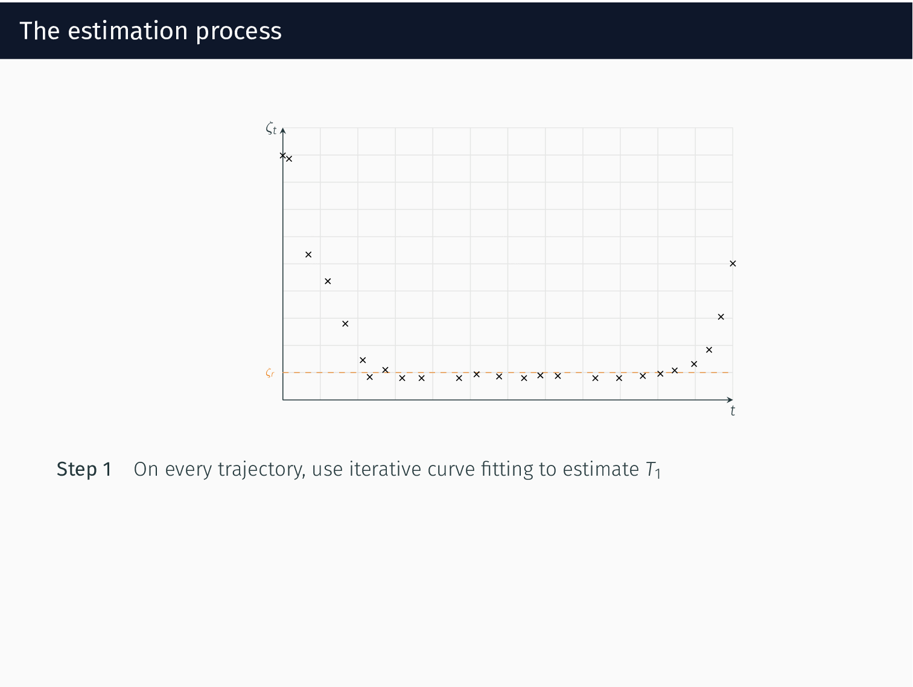

Estimating relapse time distribution from longitudinal biomarker trajectories using iterative regression and continuous time Markov processes
=============================================================================================================================================

This repository is the official implementation of `Estimating relapse time distribution from longitudinal biomarker trajectories using iterative regression and continuous time Markov processes <https://arxiv.org/>`_. 

:Authors:
    Alice Cleynen,
    Benoîte de Saporta,
    Amélie Vernay

Illustration of the estimation process
--------------------------------------

Below is an animated illustration for the estimation process desbribed in Section 3.3 of the paper.

Reproducing results from paper
------------------------------

Requires Python 3.6+.

**Note:** The column `spike` in the file containing real data corresponds to the M-protein levels.

1. Clone the benchmark repository and ``cd`` to it

.. code-block:: bash

   git clone https://github.com/AmelieVernay/pdmp_relapse_time.git
   cd pdmp_relapse_time

2. Run the full estimation process --- example with Scenario I

.. code-block:: bash
   
   cd code
   python run_xps.py --config-file ../config_files/xps_config_scenario1.yml --results ../results/scenario1

Citing
------

.. code-block:: bibtex

   @inproceedings{xxx,
      author    = {xxx},
      title     = {xxx},
      year      = {xxx},
      url       = {xxx}
   }

